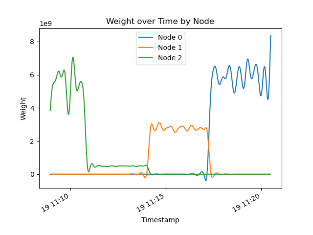
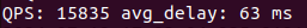
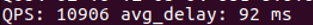

# libCoNet-RPC

## 介绍
---
Linux 下 C++ 基于 `ucontext` 库实现轻量级对称协程，HOOK 了常用 SOCKET 的 API，并实现了基于ProtoBuf的RPC框架，支持Locality-aware负载均衡和Zookeeper命名服务。

## 特性
---
* 基于 `boost::ucontext` 函数集开发了协程对象
* 实现了线程/协程调度器，自带负载均衡，同时支持用户指定 CPU 核心数和特定 CPU 核心来运行任务
* 可根据实际需要动态配置协程栈大小，同时配置了内存池提升多协程的调度速度
* 将复杂的异步处理流程隐藏在框架底层，通过类似 Golang 接口的 `netco::co_go()` 完成协程接口封装，上层用户可以使用业务同步开发的方式获得异步的高性能，避免了异步回调和回调分离引发的代码支离破碎
* HOOK 了 SOCKET 类，用户可以使用同步开发的方式调用非阻塞的 `Socket::send`, `Socket::read`, `Socket::accept`, `Socket::connect` 方法，同时实现了非阻塞的协程 TCP 服务器
* 支持基于ProtoBuf的RPC框架，客户端只需将`ServiceName` `MethodName` 和ProtoBuf序列化后的参数`args`传递给`RpcClient::call`，即可调用远程服务。服务端调用`RpcServer::add_service`即可注册服务。
* RPC客户端支持Locality-aware负载均衡和随机负载均衡
* 支持Zookeeper命名服务，服务端通过Zookeeper注册服务，客户端通过Zookeeper发现服务并调用
* 用户继承LoadBalancer抽象类，实现自己的负载均衡算法；继承NameService抽象类，实现自己的命名服务
## 使用
---
基于CMake编译，./example下为示例代码，可参考示例代码编写自己的程序，生成的可执行文件在./bin目录下。

```sh
cmake .
make
```

./example/rpc_client_pb_test.cc为客户端示例代码，实现了压力测试，统计QPS与平均延时。
./example/rpc_server_can_set_delay为服务端示例代码，实现了factorial计算服务，并可通过TCP连接设置延时。

## LALB负载均衡
---
LALB负载均衡算法基于Locality-aware的思想，以QPS/Latency为权重的加权随机算法自适应分配任务到各个服务器。

开启3台RpcServer，分别设定延时为1、3、9ms，一段时间后翻转延时，各节点的权重变化：



## 负载均衡测试
---
同时开启3台RpcServer，运行rpc_server_can_set_delay.cc，分别设定延时为1、3、9ms。启动rpc_client_pb_test.cc，设置连接数为5000，对比Locality-aware和随机负载均衡的QPS和平均延时。

Locality-aware负载均衡：

Random负载均衡：



<!-- ## 类图
---
### 日志系统

### netco协程库
 -->
