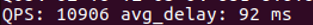

# Locality-Aware Load Balancing(LALB)

## 背景

LALB全称Locality-aware load balancing，是一个能把请求及时、自动地送到延时最低的下游的负载均衡算法，特别适合混合部署环境。基本原理非常简单：

> 以下游节点的吞吐除以延时作为分流权值。

比如只有两台下游节点，W代表权值，QPS代表吞吐，L代表延时，那么W1 = QPS1 / L1和W2 = QPS2 / L2分别是这两个节点的分流权值，分流时随机数落入的权值区间就是流量的目的地了。
## 实现难点
- 多线程下并且可能修改节点的情况下实现o(logn)按权值分流算法：基于DoublyBufferedData和weight-tree实现
- QPS与延时数据的统计需要统计窗口，窗口越大，统计的准确性越高，但同时也减缓了对异常出现的响应速度
- 统计还未回来的延时数据

## DoublyBufferedData
LoadBalancer是一个读远大于写的数据结构：大部分时候，所有线程从一个不变的server列表中选取一台server。如果server列表真是“不变的”，那么选取server的过程就不用加锁，我们可以写更复杂的分流算法。一个方法是用读写锁，但当读临界区不是特别大时（毫秒级），读写锁并不比mutex快，而实用的分流算法不可能到毫秒级，否则开销也太大了。另一个方法是双缓冲，很多检索端用类似的方法实现无锁的查找过程。具体实现如下：
- 数据分前台与后台
- 读时获取一把thread-local锁，在读完数据后释放锁
- 写操作之间互斥，写时先修改后台数据，随后原子地切换前台与后台数据，然后逐个获取所有thread-local锁后立即释放锁，随后修改老前台（新后台）

我们来分析下这个方法的基本原理：

- 当一个读正在发生时，它会拿着所在线程的thread-local锁，这把锁会挡住同时进行的写，从而保证前台数据不会被修改。
- 在大部分时候thread-local锁都没有竞争，对性能影响很小。
- 逐个获取thread-local锁并立刻释放是为了**确保对应的读线程看到了切换后的新前台**。如果所有的读线程都看到了新前台，写线程便可以安全地修改老前台（新后台）了。
## weight-tree

### select
分流算法基于完全二叉树实现，等同与基于前缀和的二分查找，复杂度***o(logn)***，每个节点记录了权值`weight`还额外存储了左子树的节点权值之和`left`，同时记录所有节点的权值之和`weight_sum`。生成一个[1, weight_sum]的随机数`dice`，若一个节点的`left`<`dice`，且`left`+`weight`>`dice`，则该节点为目标节点。若`left`<`dice`，则向左子树递归，若`left`+`weight`>=`dice`，则向右子树递归。

### add
添加节点时，将新节点添加到二叉树末尾，并向上更新所有节点的`left`, 复杂度***o(logn)***

### remove
删除节点时，将该节点复制为二叉树末尾的节点的数据，随后删除末尾节点，并在原节点和末尾节点向上更新所有节点的`left`, 复杂度***o(logn)***

### update
在`add` `remove` `select`等操作时都会更新节点的权值，此时若使用锁保护，会导致大量的锁竞争，因此我们只用**原子操作**更新追求**最终一致性**，而不追求实时一致性。

### bounded queue
我们用限长队列来统计完成的请求与延时，详见`/src/rpc_proto/locality_aware_load_balancer.cc/LocalityAwareLoadBalancer::Weight::Update`

## inflight delay

我们必须追踪还未结束的RPC，否则我们就必须等待到超时或其他错误发生，而这可能会很慢（超时一般会是正常延时的若干倍），在这段时间内我们可能做出了很多错误的分流。最简单的方法是统计未结束RPC的耗时：

- 选择server时累加发出时间和未结束次数。
- 反馈时扣除发出时间和未结束次数。
- 框架保证每个选择总对应一次反馈。

这样“当前时间 - 发出时间之和 / 未结束次数”便是未结束RPC的平均耗时，我们称之为inflight delay。当inflight delay大于平均延时时，我们就线性地惩罚节点权值，即weight = base_weight * avg_latency / inflight_delay。当发向一个节点的请求没有在平均延时内回来时，它的权值就会很快下降，从而纠正我们的行为，这比等待超时快多了。不过这没有考虑延时的正常抖动，我们还得有方差，方差可以来自统计，也可简单线性于平均延时。不管怎样，有了方差bound后，当inflight delay > avg_latency + max(bound * 3, MIN_BOUND)时才会惩罚权值。3是正态分布中的经验数值。

## 测试
---

开启3台RpcServer，分别设定延时为1、3、9ms，一段时间后翻转延时，各节点的权重变化：

可以看到，稳定后，流量几乎全部流入延时最低的节点。但算法应对跳变的情况无法很快地进行响应，在延时翻转后，经过约10分钟才恢复到稳定状态。

## 与随机负载均衡的对比
---
同时开启3台RpcServer，运行rpc_server_can_set_delay.cc，分别设定延时为1、3、9ms。启动rpc_client_pb_test.cc，设置连接数为5000，对比Locality-aware和随机负载均衡的QPS和平均延时。

Locality-aware负载均衡：

Random负载均衡：

## 参考
https://github.com/apache/brpc/blob/master/docs/cn/lalb.md